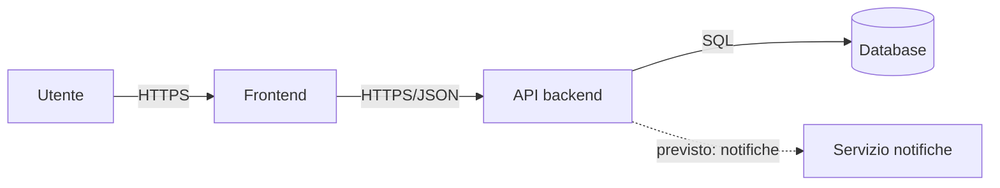

# Architettura v1 — [Smart Maintenance] / [NordFacility S.r.l.]

| | |
|---|---|
| **Team** | *DreamCode, Simone Righi - Manuel Boscaini - Nicola Cortinovis - Nathan Seganti - Raul Zamperini* |
| **Cliente** | *NordFacility S.r.l.* |
| **Data** | 23/09/2026 |
| **Versione** | v1 — provvisoria per definizione, la confronterete con la v2 a dicembre |

*Questo template è agnostico rispetto al linguaggio: ogni team scelto il
proprio stack (linguaggio, framework, database), qui si descrivono
componenti e responsabilità, non implementazioni.*

## Componenti

*Un componente è un pezzo che potreste rilasciare, sostituire o spegnere da
solo. Per ciascuno: una riga di responsabilità, una di non-responsabilità. Se
per descriverne uno vi serve una "e" tra due responsabilità diverse, sono
probabilmente due componenti.*

| Componente | Risponde di | Non risponde di |
|---|---|---|
| *Esempio: API backend* | *regole, validazione, transizioni di stato, autorizzazione* | *come i dati appaiono a schermo* |
| | | |
| | | |
| | | |

## Diagramma

*Scatole = componenti, frecce = "chiama"/"dipende da" con sopra cosa passa
(es. HTTPS/JSON, SQL, file). Segnate cosa è dentro il vostro perimetro e cosa
è fuori (servizi di terzi, sistemi del cliente). Ciò che è previsto ma non
ancora realizzato si disegna tratteggiato. Va bene un blocco Mermaid come
questo, un disegno fotografato, o qualunque notazione capiate a colpo
d'occhio come team — l'importante è che le frecce siano etichettate.*

## Dipendenze

*Elenco esplicito: chi dipende da chi, e cosa succede se il componente da cui
si dipende si ferma o risponde male.*

| Componente | Dipende da | Se si ferma |
|---|---|---|
| *Esempio: Frontend* | *API backend* | *l'utente vede un errore, nessun dato scritto due volte* |
| | | |

## Fuori dal perimetro

*Cosa esiste ma non lo costruite voi: sistemi del cliente, servizi esterni,
integrazioni future dichiarate nella richiesta.*

- Esempio: integrazione con sistemi di notifica aziendali (futura, non in v1)
